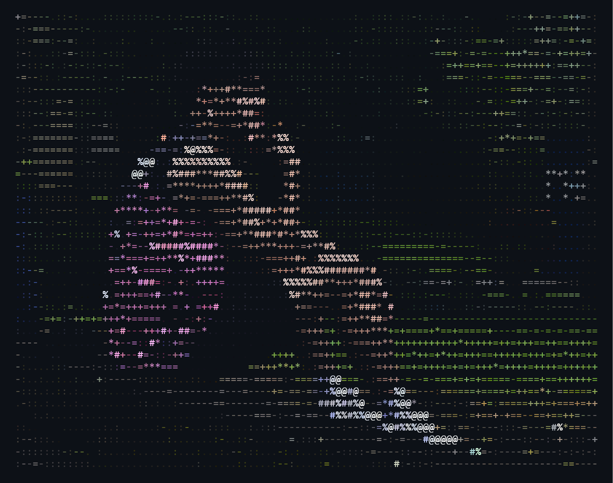

# Jahleel Nemuel Casintahan

**Full-Stack Web Developer | IT Graduate | AI Integration**

 

## About

Graduating Information Technology student focused on building modern, full-stack web applications. Experienced across both frontend and backend development, with a particular interest in integrating AI-powered features to make applications smarter and more efficient.

 

## Tech Stack

**Languages**
 

**Frontend**
 

**Backend**
 

**Databases**
 

**Tools & Platforms**
 

 

## GitHub Stats

 

 

 

